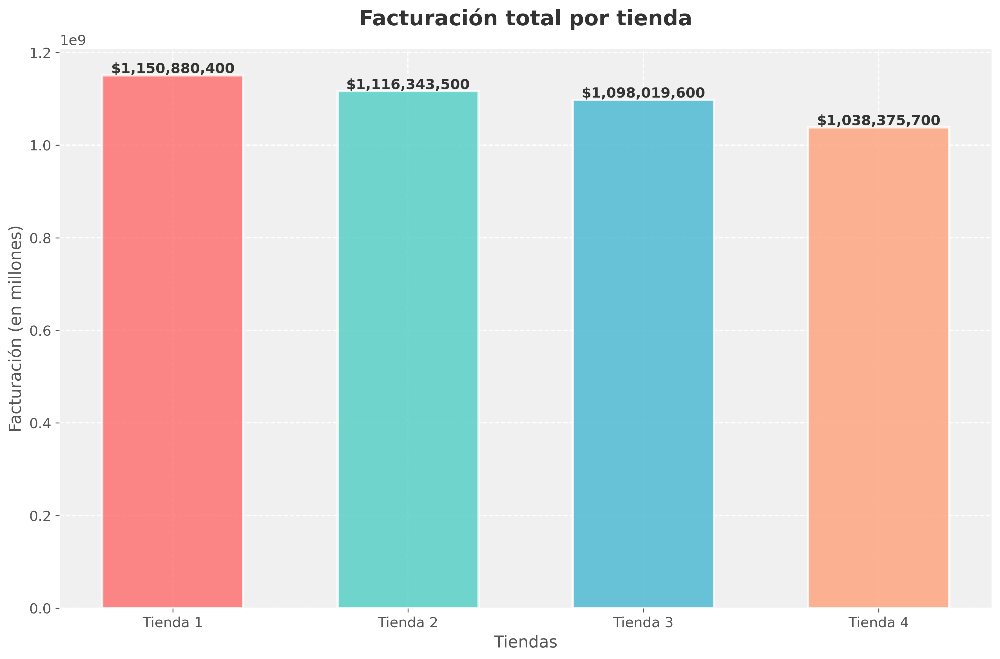
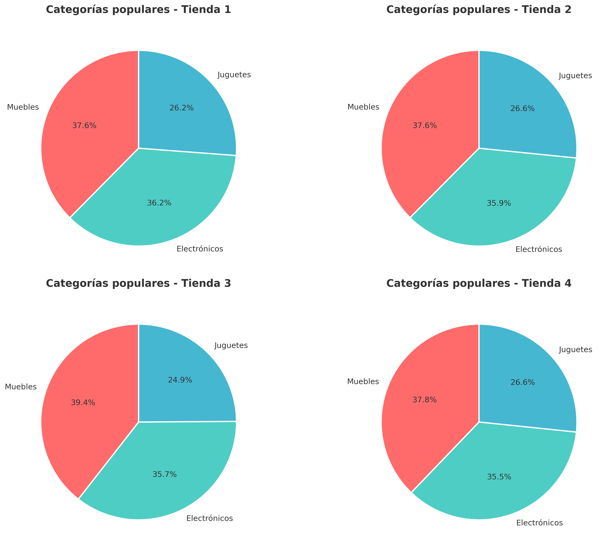
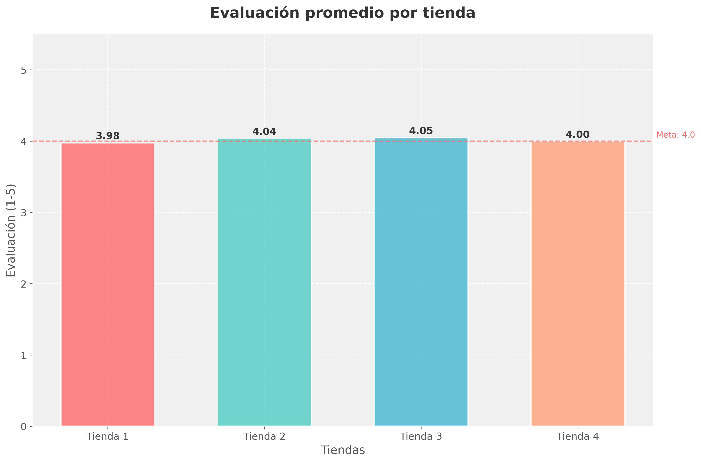
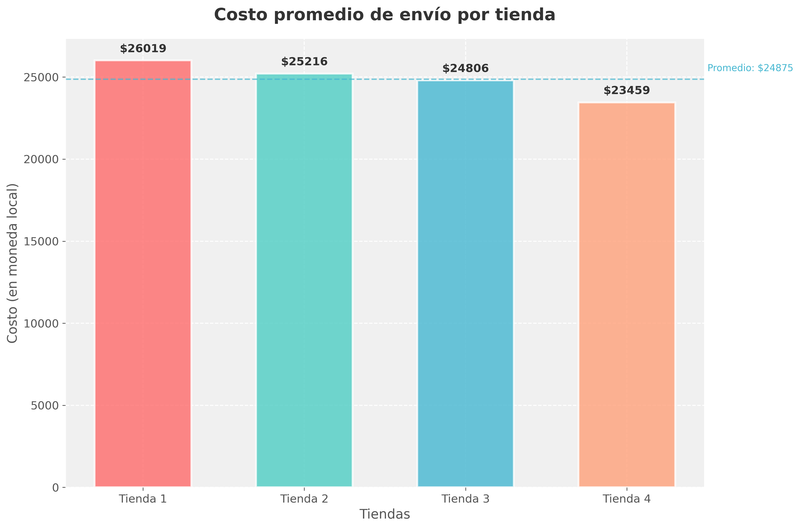
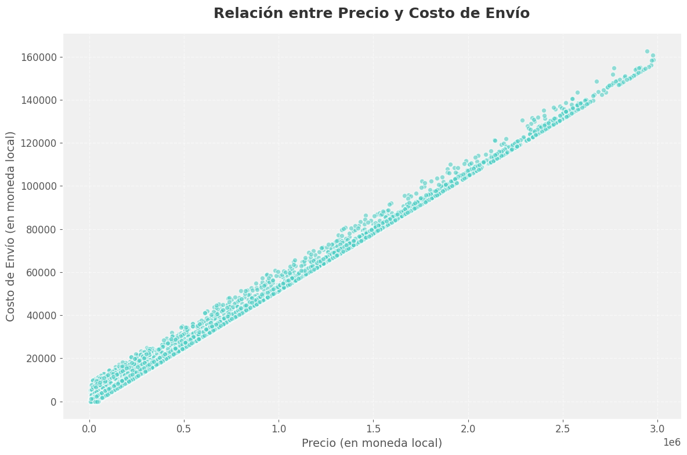
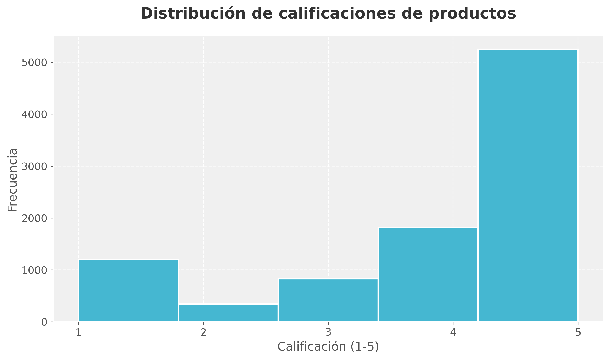
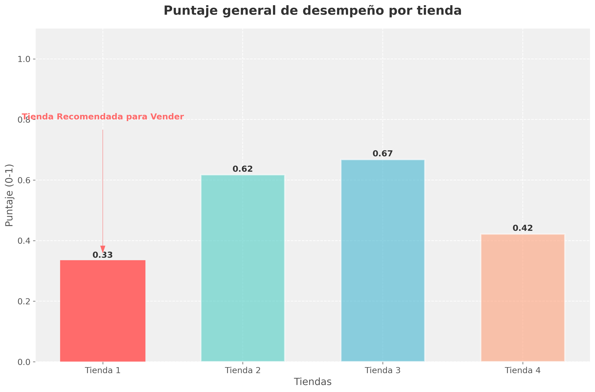

# 📊 Desafío Alura Store - Análisis de Ventas 🛍️


## 📝 Descripción del Proyecto

¡Bienvenido al desafío Alura Store! 🎯 Este proyecto ayuda al Sr. Juan a decidir qué tienda de su cadena debe vender para iniciar un nuevo emprendimiento.

Mediante el análisis de datos de ventas, rendimiento y reseñas de las 4 tiendas de Alura Store, identificamos la tienda menos eficiente y presentamos una recomendación final basada en datos concretos. 📈

## 🎯 Objetivo Principal

El objetivo es analizar 5 aspectos clave de cada tienda:
- 💰 Facturación total
- 🏷️ Categorías más populares
- ⭐ Evaluación promedio de clientes
- 📦 Productos más y menos vendidos
- 🚚 Costo promedio de envío

Y con esta información, recomendar cuál tienda vender para invertir en un nuevo negocio. 💡

## 🛠️ Tecnologías Utilizadas

-  - Lenguaje de programación principal
-  - Manipulación y análisis de datos
-  - Visualización de datos
-  - Entorno de desarrollo

## 🚀 Cómo Ejecutar el Proyecto

1. **Clona el repositorio** 📥:
    ```bash
    git clone [https://github.com/gedp/challenge1-data-science-latam.git](https://github.com/gedp/challenge1-data-science-latam.git)
    ```
2. **Abre el notebook** en Google Colab o tu entorno de desarrollo Python preferido.
3. **Ejecuta todas las celdas** para cargar los datos, realizar el análisis y generar las visualizaciones. ✨

## 📈 Análisis de Datos y Visualizaciones

Aquí encontrarás las visualizaciones clave generadas a partir del análisis de datos de las tiendas. Las imágenes se encuentran en la carpeta `graficas`.

### Facturación Total por Tienda



### Categorías Más Populares por Tienda



### Evaluación Promedio por Tienda



### Productos Más y Menos Vendidos por Tienda


### Costo Promedio de Envío por Tienda



### Relación entre Precio y Costo de Envío



### Distribución de Calificaciones de Productos



### Recomendación de la Tienda a Vender



## 💡 Conclusiones y Recomendación Final

Basado en el análisis exhaustivo de las 4 tiendas, se recomienda **vender la Tienda 1**.

**Razones principales:**
1. Presenta el menor puntaje general de desempeño, indicando menor eficiencia.
2. Tiene la facturación más baja en comparación con las otras tiendas.
3. Registra la evaluación promedio más baja de los clientes.
4. Presenta los costos de envío más elevados.

Estos factores la posicionan como la tienda menos rentable y con mayor potencial de mejora o desinversión.

---
Hecho con ❤️ para el desafío de Alura Latam, por: [SynergyaTech](https://synergya.tech)
